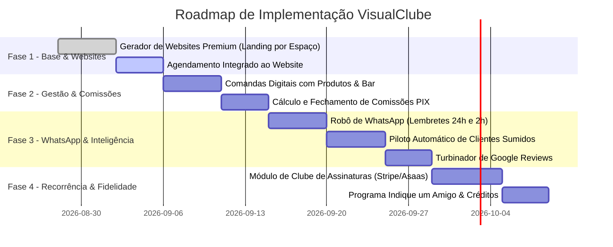

# 05 — Diferenciais "Fora da Curva" & Roadmap de Implementação

**Projeto:** VisualClube SaaS (Barbearias, Salões de Beleza, Spas & Estética)  
**Data:** 2026-08-27  
**Status:** 🚀 Em Planejamento & Execução

---

## 🎯 1. Visão Estratégica & Proposta de Valor

O **VisualClube** foi concebido para quebrar o padrão dos softwares tradicionais do mercado de beleza e estética (que costumam ser caros, complexos e visualmente ultrapassados). 

### Pilares da Marca:
1. **Preço Acessível:** Barreira de entrada mínima para atrair autônomos e pequenas/médias equipes.
2. **Design Premium (UI/UX):** Interface moderna, dark/light mode com padrão estético elevado tanto no painel quanto no agendamento.
3. **Foco em Geração de Receita:** Funcionalidades que não apenas organizam a agenda, mas **colocam dinheiro no bolso do dono do espaço**.

---

## 💎 2. Os 7 Diferenciais "Fora da Curva"

### 1. 🌐 Website Premium na Bio (Gerador Automático de Mini-Sites)
* **Conceito:** Cada estabelecimento ganha um site profissional de alta conversão, responsivo e otimizado para celulares.
* **Recursos Inclusos:**
  * Banner com fotos do espaço, logotipo e slogan.
  * Catálogo de serviços com fotos, duração e preços.
  * Apresentação da equipe com fotos e especialidades.
  * Botão de agendamento online integrado e botão direto para WhatsApp.
  * Mapa de localização (Google Maps), horários de funcionamento e links de redes sociais.
* **Impacto Comercial:** Economiza de R$ 1.500 a R$ 3.000 que o cliente gastaria contratando uma agência.

---

### 2. 🤖 Piloto Automático de Clientes Sumidos (Anti-Churn no WhatsApp)
* **Conceito:** Algoritmo inteligente que monitora o ciclo médio de retorno de cada cliente.
* **Como funciona:**
  1. O sistema calcula a frequência de visitas (ex: João faz barba/cabelo a cada 21 dias).
  2. Se atingir o 23º dia sem novo agendamento, o robô dispara uma mensagem amigável no WhatsApp.
  3. A mensagem já sugere horários vagos nos dias mais procurados (quinta, sexta e sábado).
* **Impacto Comercial:** Recupera até 25% dos clientes inativos sem nenhum esforço manual do dono.

---

### 3. 💳 Clube de Assinaturas White-label Plug & Play (Recorrência Própria)
* **Conceito:** Plataforma para criar planos de assinatura (ex: "Clube do Corte Ilimitado", "Clube da Barba Semanal", "Clube da Manicure").
* **Como funciona:**
  * Cobrança recorrente no cartão de crédito (estilo Netflix) ou PIX programado.
  * Controle de créditos/utilização automático no fechamento de comandas.
  * Relatório de faturamento fixo mensal garantido (MRR do estabelecimento).
* **Impacto Comercial:** Dá previsibilidade financeira e fidelização máxima de clientes.

---

### 4. ⭐ Turbinador de Avaliações 5 Estrelas no Google (SEO Local)
* **Conceito:** Coleta automatizada de avaliações após o atendimento para ranquear o espaço no Google Maps.
* **Como funciona:**
  * 30 a 60 minutos após o pagamento da comanda, o cliente recebe uma pesquisa rápida no WhatsApp (1 a 5 estrelas).
  * **Nota 5:** Redireciona com 1 clique para publicar a avaliação no perfil do Google Meu Negócio do espaço.
  * **Nota menor que 4:** Envia o feedback internamente para o WhatsApp do proprietário resolver o problema sem queimar a nota pública.
* **Impacto Comercial:** Coloca o estabelecimento nas primeiras posições do Google da cidade gratuitamente.

---

### 5. 📱 Painel Mobile da Equipe no WhatsApp (Zero Fricção)
* **Conceito:** Interface ultraleve e notificações para os profissionais sem necessidade de baixar apps pesados.
* **Como funciona:**
  * O profissional recebe a agenda do dia toda manhã no WhatsApp.
  * Acompanha o total de comissões acumuladas em tempo real.
  * Pode lançar produtos (bebidas, pomadas, tratamentos) na comanda do cliente direto da cadeira.
* **Impacto Comercial:** Elimina a resistência dos barbeiros/cabeleireiros em usar o sistema.

---

### 6. 👥 Módulo "Indique um Amigo" (Viralidade Integrada)
* **Conceito:** Sistema de indicação cliente-para-cliente para gerar novos clientes sem gastar com anúncios.
* **Como funciona:**
  * Todo cliente cadastrado tem seu link exclusivo de indicação.
  * O amigo ganha desconto no 1º serviço (ex: 10%) e quem indicou ganha cashback/crédito na próxima visita.
* **Impacto Comercial:** O próprio cliente se torna promotor do espaço.

---

### 7. ⚡ Fechamento de Comissões e Repasse PIX em 1 Clique
* **Conceito:** Automatização total do cálculo de comissões por serviço e por venda de produtos.
* **Como funciona:**
  * Percentuais personalizados por profissional e categoria.
  * Fechamento semanal/quinzenal/mensal em 1 clique com geração de relatórios limpos.
  * Chave PIX de cada profissional pronta para copiar e colar.
* **Impacto Comercial:** Reduz o tempo de fechamento financeiro de horas para menos de 3 minutos.

---

## 🗺️ 3. Roadmap de Implementação Faseado

---

### 📅 Detalhamento das Fases:

#### 🟢 Fase 1: Website Premium & Agendamento Visual (Prioridade Imediata)
- [ ] Editor de Website no painel do estabelecimento (Upload de logo, fotos do espaço, redes sociais, bio).
- [ ] Página pública `visualclube.com.br/b/[slug]` com design premium estilo landing page.
- [ ] Fluxo de agendamento intuitivo (escolha do serviço, profissional, data/hora e confirmação).

#### 🟡 Fase 2: Comandas Digitais & Fechamento de Comissões
- [ ] Módulo de comandas com adição rápida de serviços, produtos para casa e bar/bebidas.
- [ ] Configuração de comissões por percentual ou valor fixo por colaborador.
- [ ] Relatório de fechamento com botão "Copiar Chave PIX" do profissional.

#### 🟣 Fase 3: Automações de WhatsApp & Google Reviews
- [ ] Disparo de lembrete automático e confirmação de presença (redução de no-show).
- [ ] Algoritmo de frequência e reativação automática de clientes inativos.
- [ ] Disparo de pesquisa de satisfação com integração ao Google Meu Negócio.

#### 🔵 Fase 4: Clube de Assinaturas & Motor de Indicação
- [ ] Criação de planos de assinatura recorrentes para o cliente final.
- [ ] Integração com gateway de pagamento recorrente (cartão/PIX).
- [ ] Sistema de links de indicação e créditos em conta.

---

## 📊 4. Distribuição nos Planos da Plataforma

| Funcionalidade | Start (Básico) | Pro (Mais Vendido) | Elite (Avançado) |
| :--- | :---: | :---: | :---: |
| **Agendamento Online 24/7** | ✅ | ✅ | ✅ |
| **Comandas Digitais + Bar/Produtos** | ✅ | ✅ | ✅ |
| **Website Premium na Bio** | ✅ Padrão | ✅ Customizado | ✅ Multi-unidades |
| **Robô de Lembretes WhatsApp** | ✅ Básico | ✅ Ilimitado | ✅ Ilimitado |
| **Fechamento de Comissões PIX** | ✅ | ✅ | ✅ |
| **Piloto Automático (Clientes Sumidos)** | ❌ | ✅ | ✅ |
| **Turbinador de Google Reviews** | ❌ | ✅ | ✅ |
| **Clube de Assinaturas VIP** | ❌ | ✅ | ✅ |
| **Módulo Indique um Amigo** | ❌ | ✅ | ✅ |
